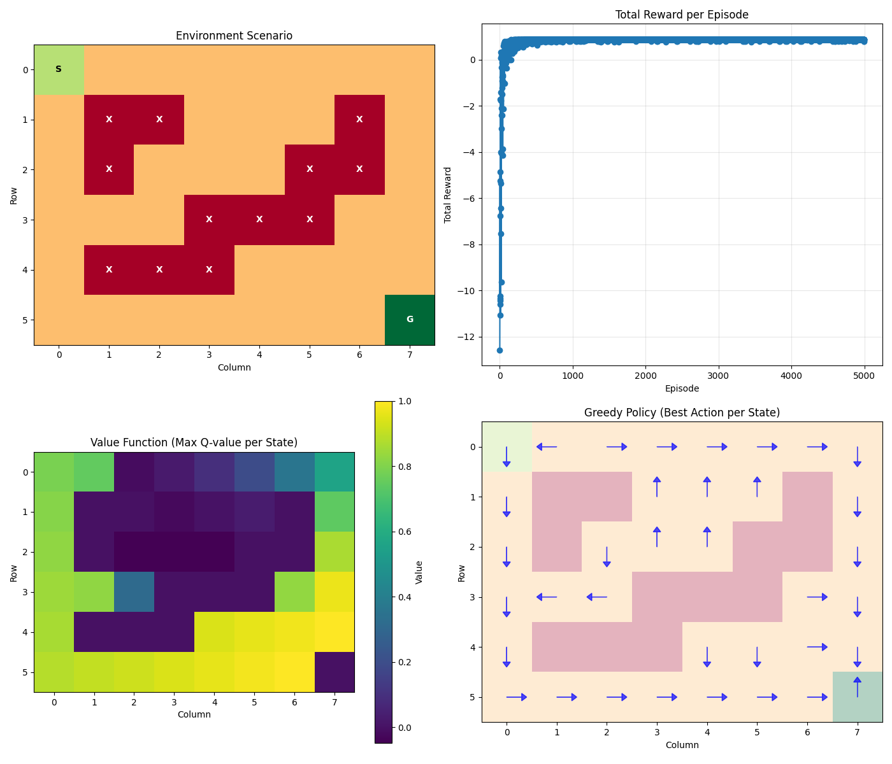
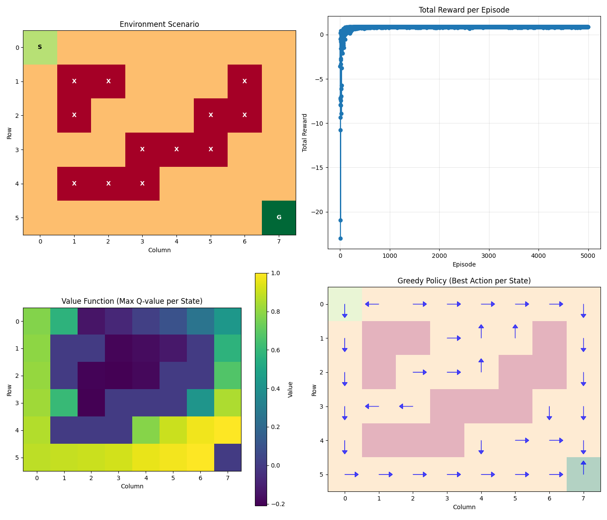
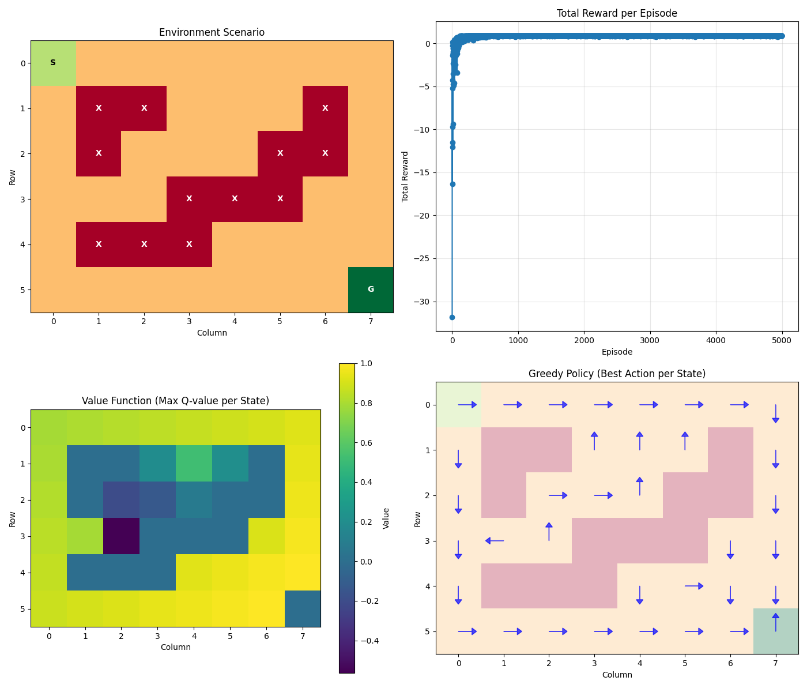

# gridworld_rl

A from-scratch 2D grid environment and sandbox for experimenting with classic tabular reinforcement learning algorithms.

## Overview

This project implements a custom `GridWorld` environment packaged as a local Python module, with standalone experiment scripts for Q-Learning, SARSA, and Monte Carlo control. Each experiment trains an agent on a custom maze with obstacles and plots the reward curve, value-function and learned greedy policy over training.

## Environment

The `GridWorld` environment (in `gridworld_rl/env.py`) is a 2D grid with the following features:

- Configurable grid size, start position, and goal position
- Obstacle placement for maze-like layouts
- Four actions: up, down, left, right
- Step penalty reward with a positive terminal reward on reaching the goal
- Coordinate system uses matrix-index convention (origin at top-left)
- Gym-style interface: `reset()`, `step(action)` → `(obs, reward, done, info)`

```
(0,0) ───────────────► col
  │   . . . . . . . .
  │   . █ █ . . . . .
  │   . █ . . . █ █ .
  ▼   . █ █ █ █ █ . .
 row  . █ █ █ . . . .
      . . . . . . . G
```

## Installation

Clone the repo and install the package locally:

```bash
git clone https://github.com/parth-potdar/gridworld_rl.git
cd gridworld_rl
pip install -e .
```

## Project Structure

```
gridworld_rl/
├── gridworld_rl/
│   ├── __init__.py
│   ├── env.py                   # Gridworld environment
│   └── utils.py                 # Utility functions e.g. epsilon-greedy policy
├── experiments/
│   ├── q_learning.py            # Q-Learning (off-policy TD)
│   ├── sarsa.py                 # SARSA (on-policy TD)
│   ├── monte_carlo_learning.py  # Every-visit Monte Carlo
│   ├── random_policy.py         # Random baseline
|   ├── results/
|       ├── q_learning.png          
|       ├── sarsa.png                
|       └── monte_carlo.png          
├── pyproject.toml
└── README.md
```

## Algorithms

### Q-Learning (Off-Policy TD)
Tabular Q-learning with a TD(0) update. The bootstrap target uses the greedy maximum over the next state's Q-values, making it off-policy and independent of the behaviour policy.

```
Q(s,a) ← Q(s,a) + α [ r + γ · max_a' Q(s',a') - Q(s,a) ]
```

### SARSA (On-Policy TD)
Same TD(0) structure as Q-learning, but `a'` is sampled from the current epsilon-greedy policy rather than taken greedily. SARSA is on-policy and tends to be more conservative near obstacles during training.

```
Q(s,a) ← Q(s,a) + α [ r + γ · Q(s',a') - Q(s,a) ]
```

Note: `a'` must be carried forward as the action executed in the next step to preserve the on-policy guarantee.

### Monte Carlo (Every-Visit)
Updates Q-values using the actual discounted return from each full episode rather than bootstrapping. Every-visit MC updates a state-action pair each time it is visited within an episode.

```
Q(s,a) ← Q(s,a) + α [ G_t - Q(s,a) ]
```

## Running Experiments

Each script in `experiments/` is self-contained. Run any of them from the repo root:

```bash
python experiments/q_learning.py
python experiments/sarsa.py
python experiments/monte_carlo_learning.py
python experiments/random_policy.py   # random baseline
```
## Results

All three algorithms were trained on the same 6×8 maze. Plots show total reward per episode over training, and learned value function and greedy-policy.

### Q-Learning


### SARSA


### Monte Carlo


**Key observations:**
- Monte Carlo converged fastest on this environment. Short deterministic episodes and sparse rewards mean the full return propagates the goal signal more efficiently than TD bootstrapping from a cold Q-table.
- SARSA is more conservative than Q-learning near obstacles, as its on-policy updates account for exploratory actions during training.
- Q-learning converges to the optimal policy but is slower to propagate reward signal back from the goal early in training.

## Hyperparameters (default)

| Parameter | Value |
|-----------|-------|
| Learning rate α | 0.1 |
| Discount γ | 0.99 |
| Initial epsilon | 1.0 |
| Epsilon decay | 0.995 per episode |
| Min epsilon | 0.01 |

## Requirements

- Python ≥ 3.12
- numpy
- matplotlib